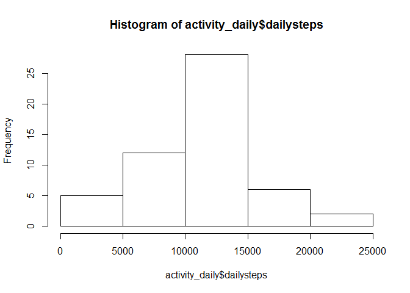
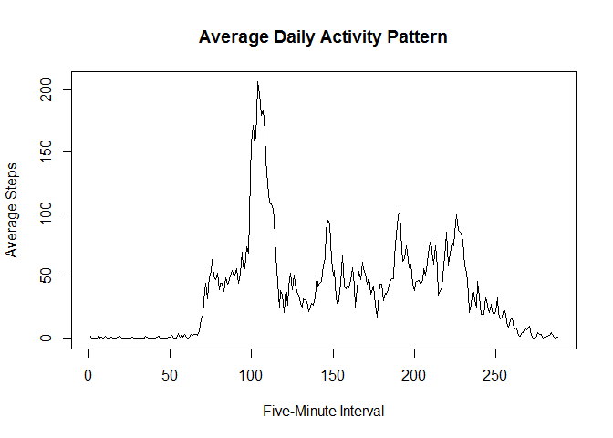
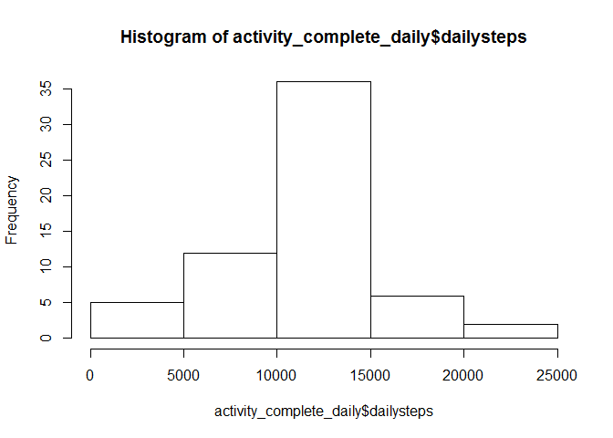
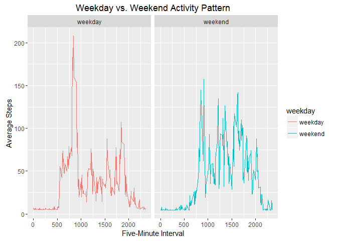

# Reproducible Research Course Project 1
Allie Rogers  
November 28, 2016  


## Loading and preprocessing the data


```r
library("dplyr")
```

```
## Warning: package 'dplyr' was built under R version 3.2.5
```

```
## 
## Attaching package: 'dplyr'
```

```
## The following objects are masked from 'package:stats':
## 
##     filter, lag
```

```
## The following objects are masked from 'package:base':
## 
##     intersect, setdiff, setequal, union
```

```r
library("magrittr")
```

```
## Warning: package 'magrittr' was built under R version 3.2.5
```

```r
activity <- read.csv("activity.csv")
```

## What is the mean total number of steps taken per day?


```r
activity_daily <- group_by(activity, date) %>%
    summarize(dailysteps = sum(steps))

hist(activity_daily$dailysteps)
```

<!-- -->

```r
mean(activity_daily$dailysteps, na.rm = TRUE)
```

```
## [1] 10766.19
```

```r
median(activity_daily$dailysteps, na.rm = TRUE)
```

```
## [1] 10765
```
## What is the average daily activity pattern?
1. Make a time-series plot of the 5-minute interval and the average number 
of steps taken across all days.


```r
activity_interval <- group_by(activity, interval) %>%
    summarize(avgsteps = mean(steps, na.rm = TRUE))

plot(activity_interval$avgsteps, 
     type = "l",
     main = "Average Daily Activity Pattern",
     ylab = "Average Steps",
     xlab = "Five-Minute Interval")
```

<!-- -->

2. Which 5-minute interval contains the maximum number of steps?

```r
activity_max <- filter(activity_interval, 
                       avgsteps == max(activity_interval$avgsteps))
activity_max$interval
```

```
## [1] 835
```

## Imputing missing values

1. Calculate and report the total number of missing values in the dataset


```r
nrow(activity) - sum(complete.cases(activity))
```

```
## [1] 2304
```

2. Devise a strategy for filling in all of the missing values in the dataset
3. Create a new dataset that is equal to the original dataset but with the
missing data filled in


```r
activity_complete <- transform(activity, steps = ifelse(is.na(steps),
                                                    mean(steps, na.rm =  TRUE), 
                                                    steps))
```

4. Make a histogram of the total number of steps taken each day and calculate
and report the mean and median total number of steps per day. 


```r
activity_complete_daily <- group_by(activity_complete, date) %>%
    summarize(dailysteps = sum(steps))
hist(activity_complete_daily$dailysteps)
```

<!-- -->

```r
mean(activity_complete_daily$dailysteps, na.rm = TRUE)
```

```
## [1] 10766.19
```

```r
median(activity_complete_daily$dailysteps, na.rm = TRUE)
```

```
## [1] 10766.19
```

## Are there differences in activity patterns between weekdays and weekends?

1. Create a new factor variable with two levels indicating whether a given
date is a weekend or a weekday day.


```r
activity_complete <- mutate(activity_complete, 
                            weekday = ifelse(
                           grepl("Saturday|Sunday",weekdays(as.Date(activity_complete$date))),
                                    "weekend", "weekday")) %>%
    mutate(weekday = as.factor(weekday))
```

2. Make a panel plot containing a time series plot of the 5-minute intervals 
and the average number of steps taken, averaged across all weekend or
weekday days


```r
library("ggplot2")
```

```
## Warning: package 'ggplot2' was built under R version 3.2.5
```

```r
activity_complete_interval <- group_by(activity_complete, interval, weekday) %>%
    summarize(avgsteps = mean(steps, na.rm = TRUE))

g <- ggplot(activity_complete_interval, aes(x = interval, y = avgsteps, color = weekday))
g + geom_line() + facet_grid(. ~ weekday) + ylab("Average Steps")  + 
    xlab("Five-Minute Interval") + ggtitle("Weekday vs. Weekend Activity Pattern")
```

<!-- -->
